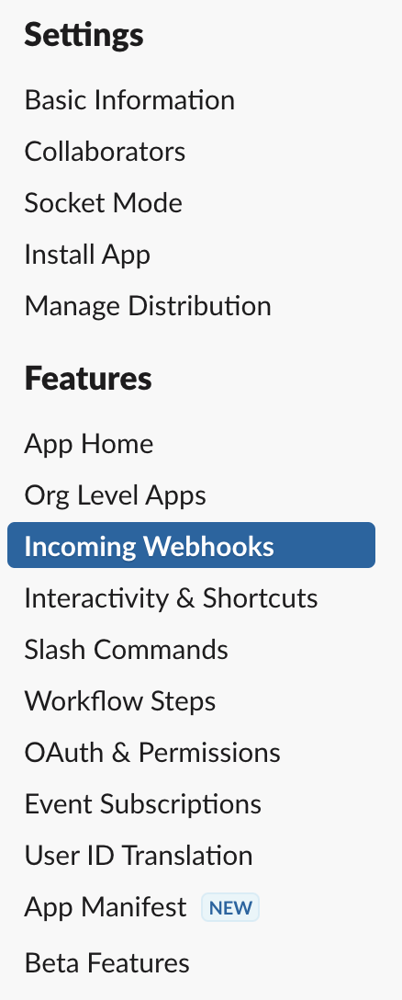

# Slack Configuration

To configure Slack notifications, you have to create a new app in your namespace and use incoming webhook function. 

1. Go to the [Slack API](https://api.slack.com) and choose *Create an app*.

2. Pick an option *From scratch*. Choose a name and namespace.

3. From your apps page, go to *Incoming webhooks* menu.

4. Activate incoming webhooks and add a new one to your workspace.

5. Now you can use webhook URL in the config.yml for alerts.